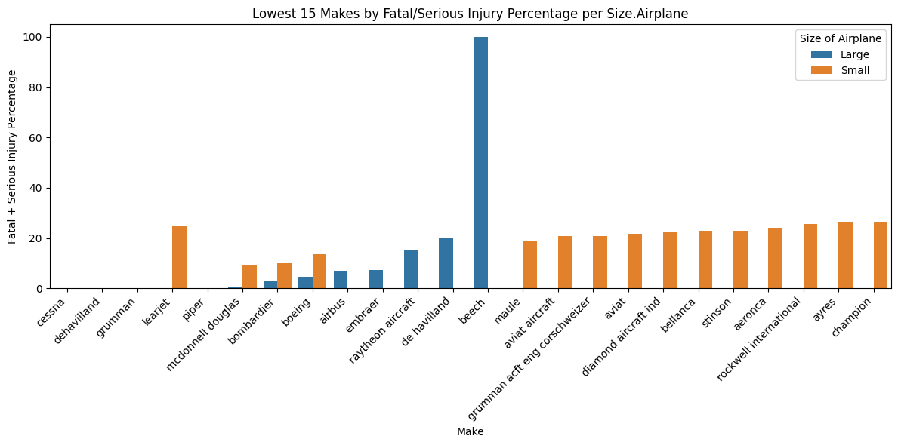
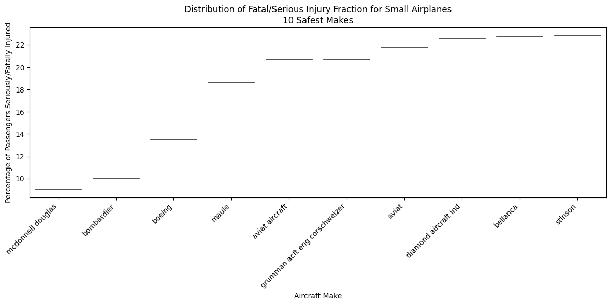
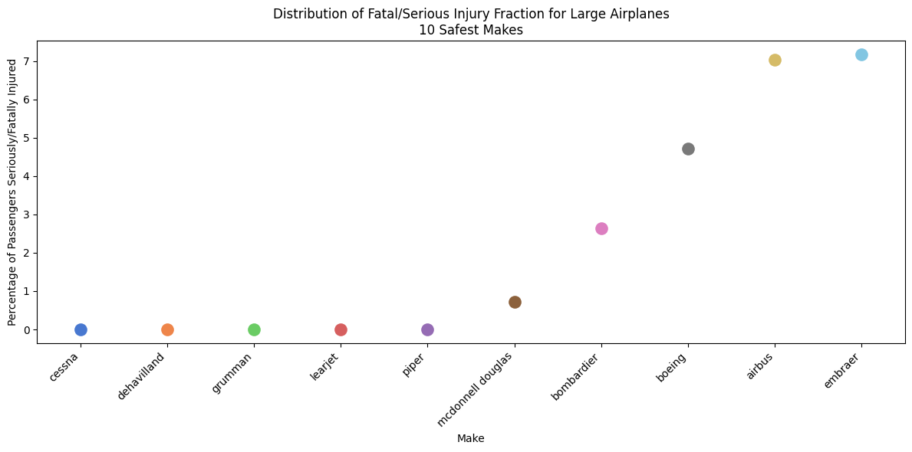
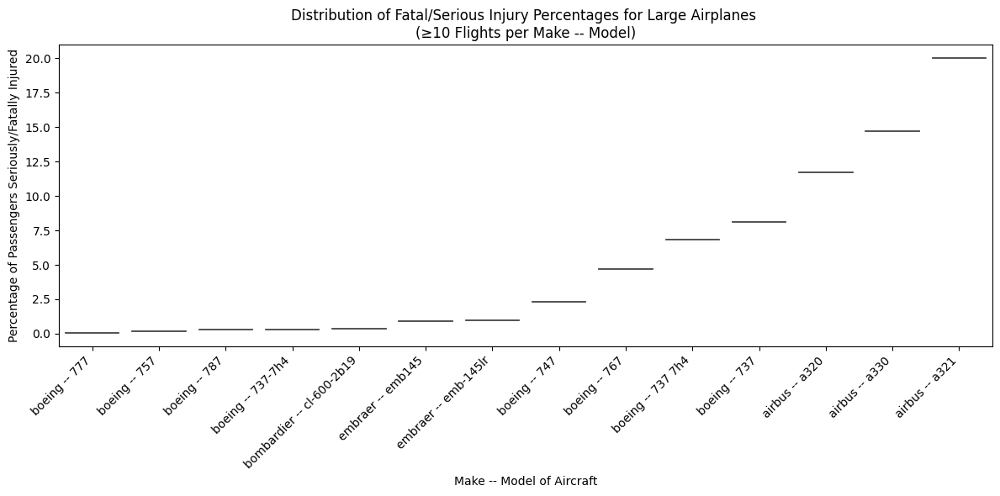
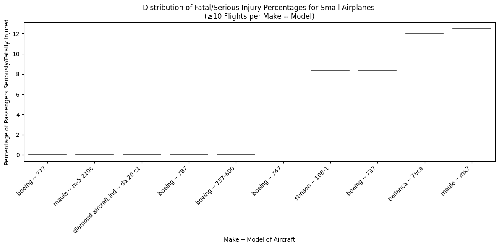
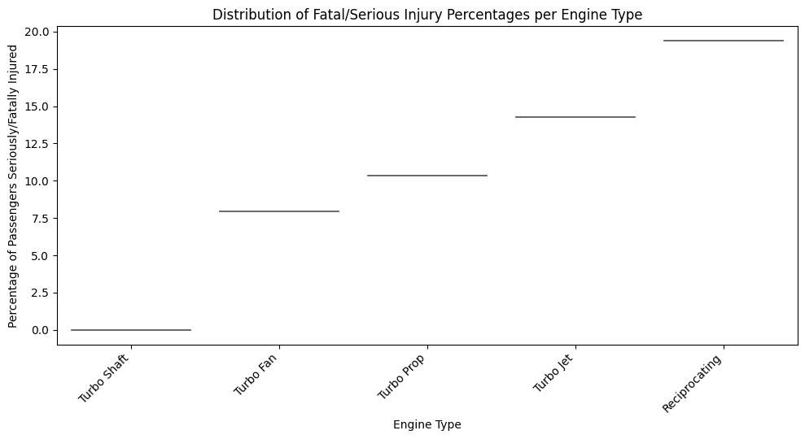
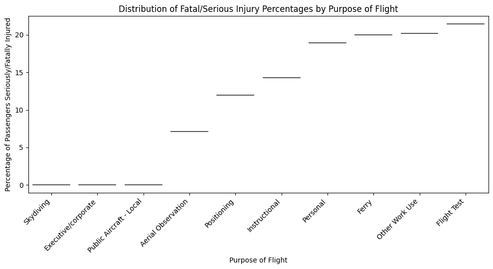

# Aviation Accident Analysis

**Overview**
Our client (an airline/airplane insurer) is interested in knowing what types of aircraft (makes/models) exhibit low rates of total destruction and low likelihood of fatal or serious passenger injuries in the event of an accident. They are also interested in any general variables/conditions that might be at play. Analysis is based on aviation accident data accumulated from the years 1948-2023.

Our client is only interested in airplane makes/models that are professional builds and could potentially still be active, so we assumed a max lifetime of 40 years for a make/model retirement and filtered the data from 1983 onwards. They would also like separate recommendations for small aircraft vs. larger passenger models. 

**Recommendation for safest "Large" Airplanes (20 or more total people on the flight):**
- The 5x Manufacturers that have never had a Serious/Fatal injury are recommended makes.  These include:  **Cessna, Dehavilland, Grumman, Learjet, and Piper**.
- Additionally, while McDonnell Douglas had a non-zero number of Serious/Fatal injuries, these only accounted for 0.72% of their passengers.  The total passenger count for McDonnell Douglas was 9,340 whereas the other "Large" Makes did not have more than 179 total passengers.  Based on this, **McDonnell Douglas** is also recommended.
- As a percentage of the total flights recorded, we see all of the previously mentioned manufacturers have had no planes destroyed to very low percentages of planes destroyed.  

**Recommendation for safest "Small" Airplanes (less than 20 total people on the flight):**
- After filtering the data, there were no small manufacturers that had 0 Serious/Fatal injuries.  
- **McDonnell Douglas, Bombardier, and Boeing** had the three lowest percentages, and would all be recommended.  McDonnel Douglas also had a low rate of serious/fatal injuries in the "Large" category, but was not in the lowest percentage of planes destroyed as a percentage of total flights.

***Of note, Defining an Airplane.Type as "Small" if there are less than 20 passengers could bias the results.  It is possible that some of the planes we tagged as "Small" were in fact "Large", but had a low percentage of their seats filled.*

**Recommendation for safest Make-Models of "Large" Airplanes (20 or more total people on the flight):**
-	We see that Boeing has 8 total models (out of 14 total) with low percentages of Serious/Fatal injuries.  The safest models appear to be the **Boeing 777, 757, 787, and 737-7h4** models, all with less than a -.33% Serious /Fatal injury rate.
-	**Bombardier’s cl-600-2b19 and Embraer’s emb145** are also recommended as they had less than a 1.0% Serious/Fatal injury rate.

**Recommendation for safest Make-Models of "Small" Airplanes (less than 20 total people on the flight):**
-	Of the 10 “Small” Make-Models with the lowest percentage of Serious/Fatal injuries, 5x had zero Serious Fatal injuries, and would all be recommended.  These include the **Boeing 777, Maule m-5-210c, Diamond Aircraft Ind - da 20 c1, Boeing 787, and Boeing 737-800**.

**Recommendation for safest Aircraft based on their `Engine Type`**:
- **`Turbo Fan` would be the most recommended Engine Type** as it had the second lowest Serious/Fatal injury rate after the Turbo Shaft, but also had the 2nd most flight records of any Engine Type in the dataset.  
- While we see in our plot that the `Turbo Shaft` Engine Type has never been recorded to have had an accident, closer inspection reveals that our dataset only has one record with a Turbo Shaft engine, so this is not statistically significant. 

**Recommendation for safest Aircraft based on the `Purpose of the Flight`:**
-	While we see in our plot that the `Skydiving`, `Public Aircraft – Local`, and `Executive/corporate` have never been recorded to have had an accident, closer inspection reveals that our dataset only has one record for the first two and two records for the third Purpose.  Based on the low number of records, these categories of Purpose cannot be recommended as they are not statistically significant.  
-	**`Aerial Observation` and `Positioning` would be the most recommended Purpose categories** as they have the next lowest Serious/Fatal injury rate.  

